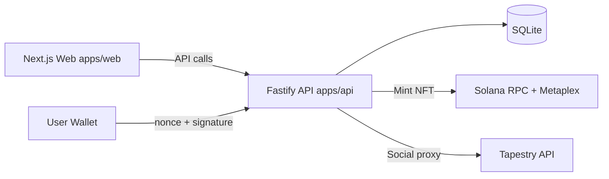
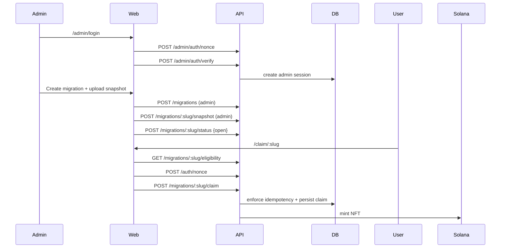

# RevivePass

RevivePass is a Solana migration portal for legacy-chain communities.  
It manages eligibility with snapshots, enforces one-time NFT claims, and includes a social layer powered by Tapestry.

## Overview

RevivePass runs two clear personas:

1. **Admin**
- Signs in with an allowlisted Solana wallet (`/admin/login`)
- Creates migration campaigns
- Uploads whitelist snapshots (combined CSV, CSV A/B merge, and manual addresses)
- Opens/closes claim windows (`draft -> open -> closed`)

2. **User**
- Opens a claim link (`/claim/:slug`)
- Connects wallet
- Checks eligibility
- Signs nonce and claims one NFT (idempotent)

## Key Features

- Admin wallet authentication (nonce + signature)
- Admin route protection for migration and snapshot management
- Snapshot lifecycle: `draft -> open -> closed`
- Whitelist import v1:
  - Combined CSV (`evm_address,solana_wallet,amount`)
  - CSV A (`evm_address,amount`) + CSV B (`evm_address,solana_wallet`) merge
  - Manual Solana wallet input merge
- Duplicate/invalid import reporting
- Claim guard hardening:
  - Not eligible => claim disabled
  - Already claimed => claim disabled
  - Migration not open => claim disabled
- One-wallet-per-migration claim enforcement
- NFT minting via Metaplex Umi
- Metadata URI from Pinata IPFS (`METADATA_URI`)
- Tapestry social integration (profiles, follows, posts, likes, comments, trending, search)

## Architecture





## Tech Stack

- **Language**: TypeScript
- **Frontend**: Next.js App Router, TailwindCSS, shadcn-style UI primitives, framer-motion, recharts, Solana wallet adapter
- **Backend**: Fastify, SQLite (`better-sqlite3`), zod, csv-parse
- **Solana**: `@solana/web3.js`, `@metaplex-foundation/umi`, `@metaplex-foundation/mpl-token-metadata`
- **Social**: Tapestry REST API proxy

## Monorepo Structure

```txt
revivepass/
  apps/
    web/
    api/
  packages/shared/
  scripts/
  samples/
  .env.example
  README.md
```

## Snapshot Input Formats

### Option 1: Combined CSV

```csv
evm_address,solana_wallet,amount
0x1111111111111111111111111111111111111111,8rN25w5ecRjT3hSLM2gFCQ8rLJiVn4A8L9jtrM7G7f1M,1
```

### Option 2: CSV A + CSV B Merge

CSV A:

```csv
evm_address,amount
0x1111111111111111111111111111111111111111,100
```

CSV B:

```csv
evm_address,solana_wallet
0x1111111111111111111111111111111111111111,8rN25w5ecRjT3hSLM2gFCQ8rLJiVn4A8L9jtrM7G7f1M
```

### Manual Wallet Input

- Admin can also paste Solana wallets manually (one per line)
- Manual entries are merged with CSV results

### Import Report

Upload response includes operational metrics such as:

- inserted
- matched / unmatchedA / unmatchedB
- duplicatesIgnored
- invalid / invalidEntries
- manualProvided / manualInserted

## Environment Variables

Copy `.env.example` to `.env` and configure:

| Variable | Purpose | Example |
| --- | --- | --- |
| `SOLANA_RPC_URL` | Solana RPC endpoint for minting | `https://api.devnet.solana.com` |
| `PRIVATE_KEY` | Mint authority secret key (JSON array) | `[1,2,3,...]` |
| `METADATA_URI` | Pinata IPFS metadata JSON URL | `https://gateway.pinata.cloud/ipfs/<cid>` |
| `DB_PATH` | SQLite database path | `./data/revivepass.sqlite` |
| `NEXT_PUBLIC_API_URL` | Frontend API base URL | `http://localhost:4000` |
| `TAPESTRY_API_URL` | Tapestry API base URL | `https://api.usetapestry.dev` |
| `TAPESTRY_API_KEY` | Tapestry API key | `replace-with-tapestry-api-key` |
| `ADMIN_WALLETS` | Comma-separated admin wallet allowlist | `<wallet1>,<wallet2>` |
| `ADMIN_SESSION_HOURS` | Admin session TTL in hours | `24` |

## Local Setup

### One-click setup

```bash
bash scripts/setup.sh
```

### Manual setup

```bash
pnpm install
pnpm db:init
pnpm seed
pnpm dev
```

Local services:

- Web: `http://localhost:3000`
- API: `http://localhost:4000`

## Admin Flow

1. Open `http://localhost:3000/admin/login`
2. Connect allowlisted wallet and sign nonce
3. Open `http://localhost:3000/admin`
4. Create migration
5. Upload snapshot (combined CSV, or CSV A/B, optional manual wallets)
6. Set migration status to `open`
7. Share claim link `/claim/:slug`
8. Set status to `closed` when campaign ends

## API Endpoints

### Public Claim/Auth

- `POST /auth/nonce`
- `POST /auth/verify`
- `GET /migrations/:slug`
- `GET /migrations/:slug/metadata`
- `GET /migrations/:slug/eligibility?wallet=...`
- `POST /migrations/:slug/claim`
- `GET /migrations/:slug/stats`

### Admin Auth

- `POST /admin/auth/nonce`
- `POST /admin/auth/verify`
- `GET /admin/auth/me`
- `POST /admin/auth/logout`

### Admin Migration Management

- `POST /migrations` (admin)
- `POST /migrations/:slug/snapshot` (admin)
- `POST /migrations/:slug/status` (admin)

### Social Proxy

- `POST /api/social/profile`
- `POST /api/social/follow`
- `POST /api/social/unfollow`
- `POST /api/social/post`
- `POST /api/social/like`
- `POST /api/social/comment`
- `GET /api/social/feed`
- `GET /api/social/trending`
- `GET /api/social/search`
- `GET /api/social/post/:postId`

## Testing & Validation

```bash
pnpm build
pnpm --filter @revivepass/api test
```

Recommended end-to-end local validation:

1. Login as admin (`/admin/login`)
2. Create migration + upload whitelist + set status `open`
3. Claim from `/claim/:slug` with eligible and non-eligible wallets
4. Confirm dashboard stats update
5. Verify social posting on `/social`

## License

MIT

