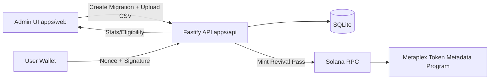
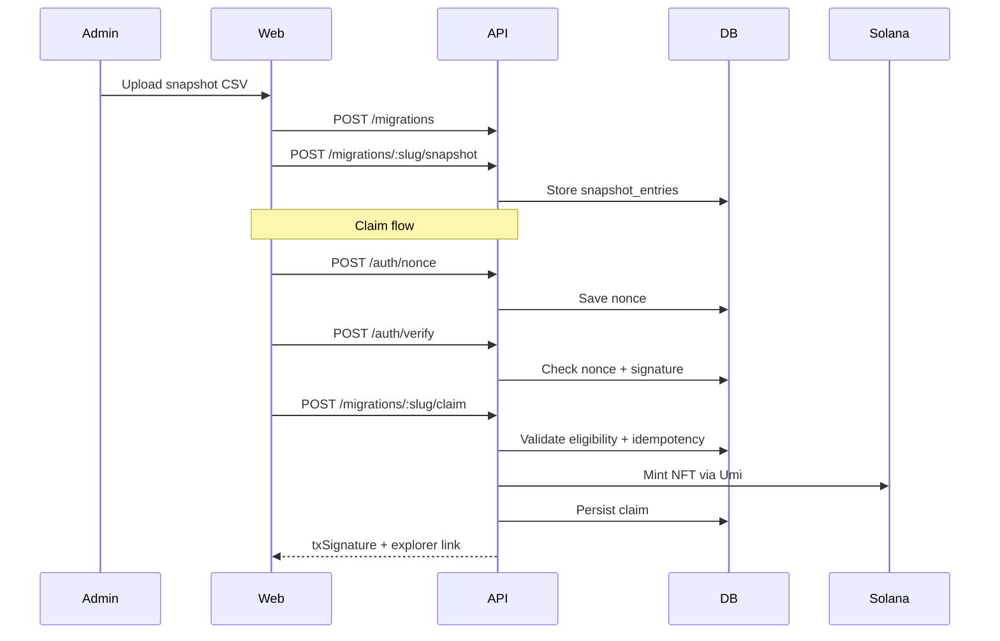

# RevivePass

RevivePass is a Solana migration portal that helps communities transition from another chain using snapshot-based eligibility and one-time NFT claims.

## Project Overview

RevivePass converts migration operations into a verifiable flow:

1. Admin creates a migration campaign.
2. Admin uploads a snapshot CSV (`evm_address,solana_wallet,amount`).
3. Community members connect Solana wallets and verify eligibility.
4. Eligible wallets claim exactly one Revival Pass NFT.
5. Dashboard tracks total holders, claimed, remaining, and claim history.

## Problem Statement

Cross-chain community migrations are usually fragmented: snapshots live in spreadsheets, eligibility checks are manual, and participation proof is weak. RevivePass provides a structured migration pipeline with wallet signatures, claim idempotency, and onchain NFT issuance.

## Features

- Snapshot-driven eligibility with CSV validation
- One-claim-per-wallet-per-migration enforcement
- Solana wallet signature auth flow (nonce + verify)
- NFT minting via Metaplex Umi
- Claim idempotency (repeat claim returns existing mint)
- Explorer link returned after claim
- Migration dashboard with progress bar + claim history chart
- Migration checklist page (Sunrise-compatible migration)
- Demo seed script and one-click setup script
- Railway-ready monorepo with separate `web` and `api` services

## Architecture





## Tech Stack

- Language: TypeScript
- Frontend: Next.js App Router, TailwindCSS, shadcn-style UI components, framer-motion, recharts, Solana wallet adapter
- Backend: Fastify, SQLite (`better-sqlite3`), zod, csv-parse
- Solana: `@solana/web3.js`, `@metaplex-foundation/umi`, `@metaplex-foundation/mpl-token-metadata`
- Deployment: Railway (two services from one repo)

## Monorepo Structure

```txt
revivepass/
  apps/
    web/
    api/
  packages/shared/
  scripts/
  samples/
  .env.example
  .gitignore
  LICENSE
  README.md
  pnpm-workspace.yaml
  package.json
```

## CSV Format

Required header:

```csv
evm_address,solana_wallet,amount
0x1111111111111111111111111111111111111111,8rN25w5ecRjT3hSLM2gFCQ8rLJiVn4A8L9jtrM7G7f1M,1
```

Validation rules:

- Headers must include `evm_address`, `solana_wallet`, `amount`
- `solana_wallet` must be present per row
- `amount` must be numeric and >= 1

## Environment Variables

Copy `.env.example` to `.env` and fill:

- `SOLANA_RPC_URL`
  - Solana RPC endpoint
  - Example: `https://api.devnet.solana.com`
- `PRIVATE_KEY`
  - Backend mint authority wallet private key as JSON array
  - Used by API to mint Revival Pass NFTs
- `PASS_IMAGE_URL`
  - Public URL to NFT image
  - Example: `https://raw.githubusercontent.com/<user>/<repo>/<branch>/apps/web/public/assets/pass.png`
- `DB_PATH`
  - SQLite path
  - Example: `./data/revivepass.sqlite`
- `NEXT_PUBLIC_API_URL`
  - Public API URL used by frontend
  - Local example: `http://localhost:4000`

## Local Setup

### One-click setup

```bash
bash scripts/setup.sh
```

This runs:

1. `pnpm install`
2. DB initialization
3. Demo seed

### Manual setup

```bash
pnpm install
pnpm db:init
pnpm seed
pnpm dev
```

Services:

- Web: `http://localhost:3000`
- API: `http://localhost:4000`

## API Endpoints

- `POST /migrations`
- `POST /migrations/:slug/snapshot`
- `GET /migrations/:slug`
- `GET /migrations/:slug/eligibility?wallet=...`
- `POST /auth/nonce`
- `POST /auth/verify`
- `POST /migrations/:slug/claim`
- `GET /migrations/:slug/stats`

## Sponsor Integrations Explanation

- Solana web3 (`@solana/web3.js`)
  - Wallet public key handling and signature verification compatibility
- Metaplex Umi + Token Metadata
  - Backend NFT mint execution for Revival Pass claims
- Wallet adapter (`@solana/wallet-adapter-react`)
  - Frontend wallet connect + sign message authentication
- SQLite (`better-sqlite3`)
  - Snapshot entries, migrations, claims, and auth nonces persistence

## Sunrise Migration Alignment

RevivePass aligns with Sunrise onboarding philosophy by making migration onboarding concrete and measurable: import legacy holder snapshots, onboard wallets, distribute migration access passes, and monitor activation via a dashboard.

References used for alignment:

- https://www.sunrisedefi.com/
- https://docs.sunrisedefi.com/
- https://solana.com/graveyard-hack

No Sunrise API integration is required.

## Railway Deployment Guide

Create **two Railway services** from this same repository:

1. API service
   - Root directory: `apps/api`
   - Start command: `pnpm --filter @revivepass/api start`
   - Required env: `SOLANA_RPC_URL`, `PRIVATE_KEY`, `PASS_IMAGE_URL`, `DB_PATH`, `PORT`
2. Web service
   - Root directory: `apps/web`
   - Start command: `pnpm --filter @revivepass/web start`
   - Required env: `NEXT_PUBLIC_API_URL`

Notes:

- Set `NEXT_PUBLIC_API_URL` in web service to your deployed API URL.
- Keep `PASS_IMAGE_URL` public and stable so minted metadata resolves correctly.

## Demo Walkthrough

1. Open `/upload`
2. Create migration slug (or use `sunrise-community`)
3. Upload `samples/demo.csv`
4. Share `/claim/<slug>` with eligible wallets
5. Claim from `/claim/<slug>`
6. Track metrics in `/dashboard/<slug>`

## Screenshots

Add screenshots after running locally:

- Landing: `apps/web/public/screenshots/landing.png`
- Upload: `apps/web/public/screenshots/upload.png`
- Claim: `apps/web/public/screenshots/claim.png`
- Dashboard: `apps/web/public/screenshots/dashboard.png`
- Checklist: `apps/web/public/screenshots/checklist.png`

## License

MIT
