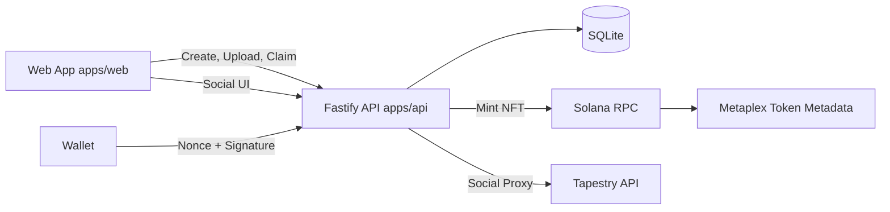
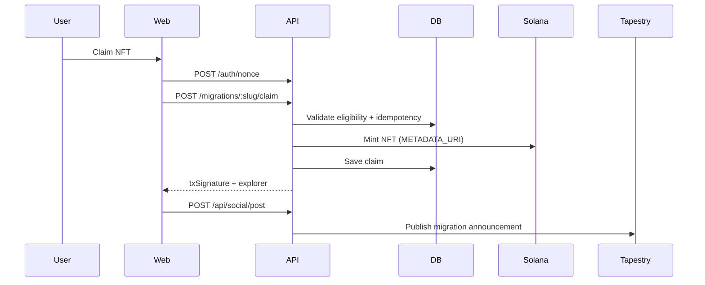

# RevivePass

RevivePass is a Solana migration portal for moving legacy-chain communities using snapshot-based eligibility, one-time NFT claims, and social activation through Tapestry.

## Project Overview

RevivePass runs migration onboarding as a verifiable flow:

1. Admin creates a migration campaign.
2. Admin uploads snapshot CSV (`evm_address,solana_wallet,amount`).
3. Wallets verify eligibility and claim one NFT.
4. Claim completion can publish an announcement to Tapestry.
5. Dashboard tracks claimed, remaining, and claim history.

## Problem Statement

Community migrations are often fragmented across spreadsheets and manual checks. RevivePass centralizes eligibility, signed wallet verification, NFT minting, and social sharing in one product flow.

## Features

- Snapshot CSV validation and ingestion
- One-wallet-per-migration claim enforcement
- Nonce + signature authentication
- NFT minting with Metaplex Umi
- Metadata URI via Pinata IPFS (`METADATA_URI`)
- Tapestry profile/follow/post/like/comment integration
- Social feed endpoint and frontend social page
- Migration dashboard with progress and claim history
- Seeded campaigns: `community-revival-demo`, `social-campaign`

## Architecture





## Tech Stack

- Language: TypeScript
- Frontend: Next.js App Router, TailwindCSS, shadcn-style UI, framer-motion, recharts, Solana wallet adapter
- Backend: Fastify, SQLite (`better-sqlite3`), zod, csv-parse
- Solana: `@solana/web3.js`, `@metaplex-foundation/umi`, `@metaplex-foundation/mpl-token-metadata`
- Social: Tapestry REST API proxy module
- Deployment: Railway (`apps/web` + `apps/api`)

## Monorepo Structure

```txt
revivepass/
  apps/
    web/
    api/
  packages/shared/
  scripts/
  samples/
  .env.example
  README.md
```

## CSV Format

```csv
evm_address,solana_wallet,amount
0x1111111111111111111111111111111111111111,8rN25w5ecRjT3hSLM2gFCQ8rLJiVn4A8L9jtrM7G7f1M,1
```

Validation rules:

- Header must include `evm_address`, `solana_wallet`, `amount`
- `solana_wallet` is required
- `amount` must be numeric and `>= 1`

## Environment Variables

Copy `.env.example` to `.env` and configure:

| Variable | Purpose | Example |
| --- | --- | --- |
| `SOLANA_RPC_URL` | Solana RPC endpoint for minting | `https://api.devnet.solana.com` |
| `PRIVATE_KEY` | Mint authority secret key (JSON array) | `[1,2,3,...]` |
| `METADATA_URI` | Pinata IPFS metadata JSON URL used in mint transaction | `https://gateway.pinata.cloud/ipfs/<cid>` |
| `DB_PATH` | SQLite database path | `./data/revivepass.sqlite` |
| `NEXT_PUBLIC_API_URL` | Frontend API base URL | `http://localhost:4000` |
| `TAPESTRY_API_URL` | Tapestry API base URL | `https://api.usetapestry.dev` |
| `TAPESTRY_API_KEY` | Tapestry API key | `replace-with-tapestry-api-key` |

## Local Setup

### One-click setup

```bash
bash scripts/setup.sh
```

### Manual setup

```bash
pnpm install
pnpm db:init
pnpm seed
pnpm dev
```

Local services:

- Web: `http://localhost:3000`
- API: `http://localhost:4000`

## Seeded Campaigns

`pnpm seed` creates and snapshots:

- `community-revival-demo` - Community Revival Demo
- `social-campaign` - Migration Social Share

## API Endpoints

Migration/Auth:

- `POST /migrations`
- `POST /migrations/:slug/snapshot`
- `GET /migrations/:slug`
- `GET /migrations/:slug/metadata`
- `GET /migrations/:slug/eligibility?wallet=...`
- `POST /auth/nonce`
- `POST /auth/verify`
- `POST /migrations/:slug/claim`
- `GET /migrations/:slug/stats`

Social proxy:

- `POST /api/social/profile`
- `POST /api/social/follow`
- `POST /api/social/unfollow`
- `POST /api/social/post`
- `POST /api/social/like`
- `POST /api/social/comment`
- `GET /api/social/feed`

## Tapestry Integration

- Backend module `apps/api/src/lib/tapestry.ts` wraps profile, follow/unfollow, post, like, comment, and feed calls.
- Backend route `apps/api/src/routes/social.ts` exposes proxy endpoints for frontend usage.
- Frontend page `/social` provides profile management and feed interactions.
- Claim completion posts a migration announcement through `/api/social/post`.

## Notes

- The previous loyalty module has been deprecated and removed.
- Migration and social flows continue to work without that dependency.

## Railway Deployment

Create two Railway services from this repo:

1. API service
- Root directory: `apps/api`
- Start command: `pnpm --filter @revivepass/api start`
- Required env: `SOLANA_RPC_URL`, `PRIVATE_KEY`, `METADATA_URI`, `DB_PATH`, `TAPESTRY_API_URL`, `TAPESTRY_API_KEY`, `PORT`

2. Web service
- Root directory: `apps/web`
- Start command: `pnpm --filter @revivepass/web start`
- Required env: `NEXT_PUBLIC_API_URL`

## Testing and Validation

Run full build:

```bash
pnpm run build
```

Run local integration flow:

1. `pnpm dev`
2. Create or use slug `social-campaign`
3. Upload `samples/demo.csv` if needed
4. Claim NFT from `/claim/<slug>`
5. Open `/social` and confirm profile/feed actions
6. Verify dashboard metrics at `/dashboard/<slug>`

## License

MIT
