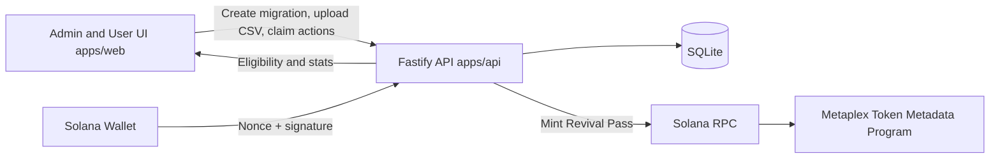
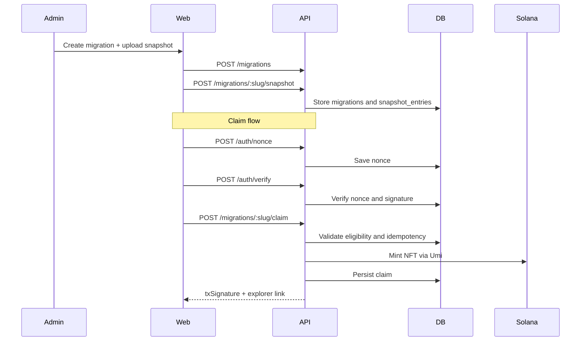

# RevivePass

RevivePass is a Solana migration portal for moving legacy-chain communities with snapshot-based eligibility and one-time NFT claims.

## Project Overview

RevivePass turns migration onboarding into an auditable flow:

1. Create a migration campaign.
2. Upload a snapshot CSV (`evm_address,solana_wallet,amount`).
3. Community wallets run eligibility checks.
4. Eligible wallets claim one Revival Pass NFT.
5. Dashboard tracks progress and claim history.

## Problem Statement

Community migrations are often fragmented across spreadsheets, forms, and manual checks. This causes weak verification, duplicated claims, and unclear progress. RevivePass centralizes the process with signed wallet verification, deterministic eligibility, idempotent claiming, and onchain NFT issuance.

## Features

- Snapshot-driven eligibility with CSV validation
- One-claim-per-wallet-per-migration enforcement
- Nonce + signature authentication flow
- NFT minting through Metaplex Umi
- Claim idempotency (retries return existing claim)
- Explorer link returned after mint
- Dashboard with claimed/remaining metrics and claim history chart
- Migration checklist page for operational rollout
- Demo seed data and one-click setup script
- Railway-ready monorepo with separate `apps/web` and `apps/api` services

## Architecture Explanation

The web app handles campaign setup, claim UX, and analytics. The API validates snapshots, manages claim state in SQLite, verifies signatures, and mints NFTs on Solana.





## Tech Stack

- Language: TypeScript
- Frontend: Next.js App Router, TailwindCSS, shadcn-style UI components, framer-motion, recharts, Solana wallet adapter
- Backend: Fastify, SQLite (`better-sqlite3`), zod, csv-parse
- Solana: `@solana/web3.js`, `@metaplex-foundation/umi`, `@metaplex-foundation/mpl-token-metadata`
- Deployment: Railway

## Monorepo Structure

```txt
revivepass/
  apps/
    web/
    api/
  packages/shared/
  scripts/
  samples/
  .env.example
  .gitignore
  LICENSE
  README.md
  pnpm-workspace.yaml
  package.json
```

## CSV Format

Required header:

```csv
evm_address,solana_wallet,amount
0x1111111111111111111111111111111111111111,8rN25w5ecRjT3hSLM2gFCQ8rLJiVn4A8L9jtrM7G7f1M,1
```

Validation rules:

- Headers must include `evm_address`, `solana_wallet`, `amount`
- `solana_wallet` is required per row
- `amount` must be numeric and greater than or equal to `1`

## Environment Variables

Copy `.env.example` to `.env`.

| Variable | Purpose | Example |
| --- | --- | --- |
| `SOLANA_RPC_URL` | Solana RPC endpoint used by API mint logic | `https://api.devnet.solana.com` |
| `PRIVATE_KEY` | Mint authority private key as JSON array | `[12,34,...]` |
| `PASS_IMAGE_URL` | Public NFT image URL used in metadata | `https://raw.githubusercontent.com/<user>/<repo>/<branch>/apps/web/public/assets/pass.png` |
| `DB_PATH` | SQLite database file path | `./data/revivepass.sqlite` |
| `NEXT_PUBLIC_API_URL` | Frontend API base URL | `http://localhost:4000` |

## Local Setup

### One-Click Setup

```bash
bash scripts/setup.sh
```

This installs dependencies, initializes SQLite, and runs seed data.

### Manual Setup

```bash
pnpm install
pnpm db:init
pnpm seed
pnpm dev
```

Local services:

- Web: `http://localhost:3000`
- API: `http://localhost:4000`

## API Endpoints

- `POST /migrations`
- `POST /migrations/:slug/snapshot`
- `GET /migrations/:slug`
- `GET /migrations/:slug/eligibility?wallet=...`
- `POST /auth/nonce`
- `POST /auth/verify`
- `POST /migrations/:slug/claim`
- `GET /migrations/:slug/stats`

## Sponsor Integrations Explanation

- Solana web3 (`@solana/web3.js`): wallet addressing and transaction compatibility
- Metaplex Umi + Token Metadata: backend NFT mint execution
- Wallet adapter (`@solana/wallet-adapter-react`): wallet connect and signature UX
- SQLite (`better-sqlite3`): migrations, snapshots, claims, and nonce persistence

## Sunrise Migration Alignment (Optional)

RevivePass supports Sunrise-style onboarding by structuring migration into snapshot preparation, wallet onboarding, pass distribution, and measurable activation tracking.

Reference materials:

- [Sunrise website](https://www.sunrisedefi.com/)
- [Sunrise docs](https://docs.sunrisedefi.com/)
- [Solana Graveyard Hack page](https://solana.com/graveyard-hack)

No Sunrise API integration is required.

## Railway Deployment Guide

Create two Railway services from this repository:

1. `apps/api`
- Root directory: `apps/api`
- Start command: `pnpm --filter @revivepass/api start`
- Required env: `SOLANA_RPC_URL`, `PRIVATE_KEY`, `PASS_IMAGE_URL`, `DB_PATH`, `PORT`

2. `apps/web`
- Root directory: `apps/web`
- Start command: `pnpm --filter @revivepass/web start`
- Required env: `NEXT_PUBLIC_API_URL`

Deployment notes:

- Set `NEXT_PUBLIC_API_URL` in the web service to the API Railway URL.
- Keep `PASS_IMAGE_URL` public and stable so minted metadata resolves consistently.

## Demo Walkthrough

1. Open the app at `/` and choose `Create`.
2. Create a migration.
3. Upload `samples/demo.csv`.
4. Share `/claim/<slug>` with eligible wallets.
5. Claim from `/claim/<slug>`.
6. Track progress in `/dashboard/<slug>`.

## Screenshots

Store screenshots in:

- `apps/web/public/screenshots/landing.png`
- `apps/web/public/screenshots/upload.png`
- `apps/web/public/screenshots/claim.png`
- `apps/web/public/screenshots/dashboard.png`
- `apps/web/public/screenshots/checklist.png`

## License

MIT
